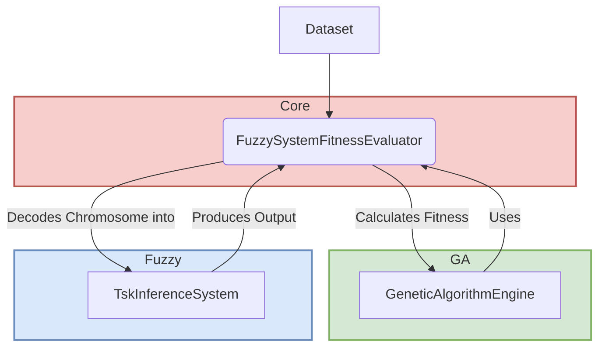

# Fuzzy-GA: Genetically-Optimized TSK Fuzzy Inference System

A modern Java 21 implementation of a Takagi-Sugeno-Kang (TSK) Fuzzy Inference System optimized by a Genetic Algorithm.


## 1. Project Overview

This project provides a flexible and high-performance framework for solving complex regression and mapping problems using a genetically-optimized fuzzy inference system. It takes a classic neuro-fuzzy system and completely refactors it into a modular, testable, and extensible system using modern Java 21 features.

### Core Features

*   **TSK Fuzzy Model:** Implements IF-THEN rules with linear function consequents (`z = px + qy + r`).
*   **Einstein Product:** Utilizes the Einstein product t-norm for a smooth fuzzy AND operation.
*   **Genetic Algorithm Optimization:** A powerful genetic algorithm tunes all parameters of the fuzzy system, including membership functions and rule consequents.
*   **Modern Java:** Built with Java 21, leveraging features like Records, Sealed Classes, and Streams for clean, performant, and maintainable code.
*   **Decoupled & Modular:** The Fuzzy System, Genetic Algorithm, and the bridge connecting them are in separate, decoupled modules, making the system easy to maintain and extend.
*   **Configurable & Extensible:** The GA is configurable via a `GaConfig` record, and the system can be extended with new membership functions or GA operators.

## 2. System Architecture

The system is composed of three primary modules that work in concert: the Fuzzy System, the Genetic Algorithm, and the Core bridge.



### Package Structure

*   `com.fuzzyga.fuzzy`: Contains all components for the TSK fuzzy inference system.
*   `com.fuzzyga.ga`: Contains the `GeneticAlgorithmEngine` and its components.
*   `com.fuzzyga.core`: The bridge between the fuzzy and GA modules, containing the `FuzzySystemFitnessEvaluator`.
*   `com.fuzzyga.app`: The main application entry point for running the system.
*   `com.fuzzyga.utils`: Utility classes for loading configuration and data.

## 3. Conceptual Background

A detailed, non-technical explanation of the core concepts can be found in `SYSTEM_CONCEPTS.md`.

## 4. Getting Started

### Prerequisites

*   Java JDK 21+
*   Apache Maven 3.8+

### Installation & Build

```bash
# Clone the repository
git clone <your-repo-url>
cd <repo-name>

# Build the project, compile sources, and run tests
mvn clean install
```

### Running the Application

The main application class `com.fuzzyga.app.App` runs the entire optimization process using the sample dataset and configuration.

```bash
# Run the main demo application from the project root
mvn exec:java -Dexec.mainClass="com.fuzzyga.app.App"
```

The application will output the progress of the genetic algorithm for each generation and print the final, best-found solution.

## 5. Usage & Code Examples

### Configuration

The GA hyperparameters can be configured in `src/main/resources/config.properties`. These parameters control the evolutionary process.

### Code Example

The following snippet (simplified from `App.java`) shows how to wire together the components to run the system.

```java
// 1. Load configuration and data
GaConfig config = ConfigLoader.loadConfig("config.properties");
Dataset dataset = Dataset.fromResource("datasets/3dfunc.txt");

// 2. Describe the desired fuzzy system architecture
InputVariable x = new InputVariable("x");
InputVariable y = new InputVariable("y");
FuzzySystemDescriptor descriptor = new FuzzySystemDescriptor(
    List.of(x, y), // Input variables
    3,             // Number of fuzzy sets per variable
    Map.of(        // Parameter ranges for optimization
        "center", new FuzzySystemDescriptor.Range(-5.0, 15.0),
        "width", new FuzzySystemDescriptor.Range(1.0, 5.0),
        "consequent", new FuzzySystemDescriptor.Range(-10.0, 10.0)
    )
);

// 3. Create the evaluator and the GA engine
FuzzySystemFitnessEvaluator evaluator = new FuzzySystemFitnessEvaluator(descriptor, dataset);
GeneticAlgorithmEngine ga = new GeneticAlgorithmEngine(config, evaluator);

// 4. Run the evolution
Individual bestSolution = ga.evolve(null, null);

// 5. Use the results
System.out.println("Best solution fitness: " + bestSolution.fitness());
```

## 6. Future Improvements

*   Support for other membership functions (Gaussian, Trapezoidal).
*   A wider variety of GA operators (e.g., different selection or crossover strategies).
*   A GUI for visualizing the fuzzy sets, rule surface, and GA convergence.
*   Support for classification problems in addition to regression.
